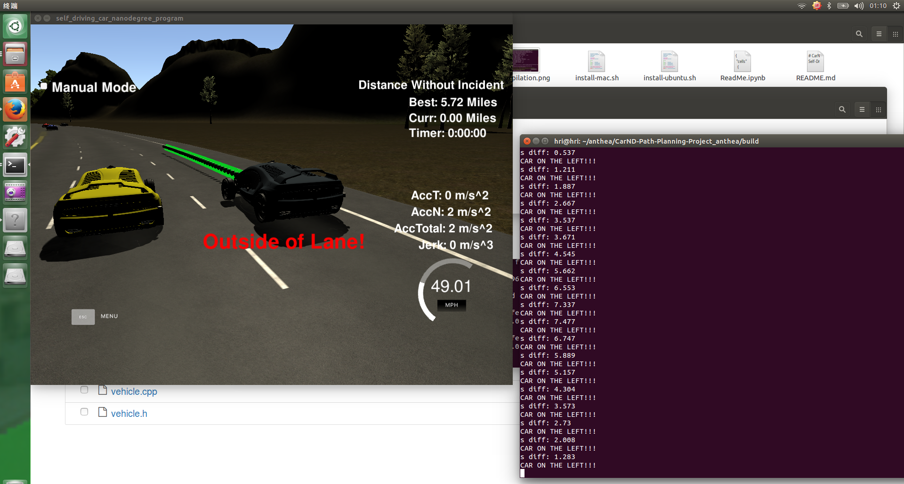

# CarND-Path-Planning-Project
---

This project aims to design a path planner which can **safely and smoothly navigate** the car around a virtual 3-lane highway with other traffic. A successful path planner will be able to keep inside its lane, avoid hitting other cars, and pass slower moving traffic all by using localization, sensor fusion, and map data.  

Here are some important reminds:

- You will be provided the car's localization, sensor fusion data, and a sparse map list of waypoints around the highway. 

- The car can drives the speed limit (50MPH) with +-10 MPH, which means it should go as close as possible to the speed limit, and pass slower traffic when possible (note that other cars will try to change lanes too). 

- The car should avoid collisions at all cost while driving inside of the marked road lanes at all the times, unless going from one lane to another. 

- The car should make one complete loop around the 6.946 km highway. (Since the car is trying to go 50 MPH, it should take a little over 5 minutes to complete 1 loop.) 

- The car should not experience total acceleration over 10 m/s^2 and jerk that is greater than 10 m/s^3, for planning smoothness.  

---
### Simulator platform
The whole project is implemented on simulator deployed by Udacity. The term3 Simulator which contains the Path Planning Project [here](https://github.com/udacity/self-driving-car-sim/releases/tag/T3_v1.2).  

To run the simulator on Mac/Linux, first make the binary file executable with the following command:
```shell
sudo chmod u+x term3_sim.x86_64
```

---

### How to build this project

1. Clone the original Udacity [repo](https://github.com/udacity/CarND-Path-Planning-Project).
2. Make a build directory: `mkdir build && cd build`.
3. Compile: `cmake .. && make`.
4. Run it: `./path_planning`.
5. Complete the TODO part in `./src/main.cpp` and compile and run again.
---
### Input data A: localization and sensor fusion data 
Here is the data provided from the Simulator to the C++ Program.

#### 1. Main car's localization Data (No Noise)

["x"] : The car's x position in map coordinates

["y"] : The car's y position in map coordinates

["s"] : The car's s position in frenet coordinates

["d"] : The car's d position in frenet coordinates

["yaw"] : The car's yaw angle in the map

["speed"] : The car's speed in MPH

#### 2. Previous path data given to the Planner

Note: Return the previous list but with processed points removed, can be a nice tool to show how far along the path has processed since last time. 

["previous_path_x"] : The previous list of x points previously given to the simulator

["previous_path_y"] : The previous list of y points previously given to the simulator

#### 3. Previous path's end s and d values 

["end_path_s"] : The previous list's last point's frenet s value

["end_path_d"] : The previous list's last point's frenet d value

#### 4. Sensor Fusion Data, a list of all other car's attributes on the same side of the road. (No Noise)

["sensor_fusion"] : A 2d vector of cars and then that car's [car's unique ID, car's x position in map coordinates, car's y position in map coordinates, car's x velocity in m/s, car's y velocity in m/s, car's s position in frenet coordinates, car's d position in frenet coordinates. 

### Input data B: sparse waypoint map

The map of the highway is in `data/highway_map.csv`. Each waypoint in the list contains  `[x,y,s,dx,dy]` values. `x` and `y` are the waypoint's map coordinate position, the `s` value is the distance along the road to get to that waypoint in meters, the `dx` and `dy` values define the unit normal vector pointing outward of the highway loop.

The highway's waypoints loop around so the frenet `s` value, distance along the road, goes from 0 to 6945.554.

----

### Project Specifications

### Compilation 
**Code must compile without errors with cmake and make.Given that we've made CMakeLists.txt as general as possible, it's recommend that you do not change it unless you can guarantee that your changes will still compile on any platform.**

My code compiles without errors with `cmake` and `make`, according to the original CMakeLists.txt, as shown in the following image.


### Valid Trajectories

All these six standards can be done correctly, as shown in the screenshot images and the attached video. The video(~560MB) is screenrecorded on Ubuntu 14.4 with software named Kazam. And it is readable on my laptop.

- **The car is able to drive at least 4.32 miles without incident. The top right screen of the simulator shows the current/best miles driven without incident. Incidents include exceeding acceleration/jerk/speed, collision, and driving outside of the lanes. Each incident case is also listed below in more detail.**

screenshot 1        | screenshot 2
:-------------------------:|:-------------------------:
  |  

screenshot 3       | screenshot 4
:-------------------------:|:-------------------------:
  |  

screenshot 5        | screenshot 6
:-------------------------:|:-------------------------:
  |  
- **The car drives according to the speed limit. The car doesn't drive faster than the speed limit. Also the car isn't driving much slower than speed limit unless obstructed by traffic.**


- **Max Acceleration and Jerk are not Exceeded.The car does not exceed a total acceleration of 10 m/s^2 and a jerk of 10 m/s^3.**


- **Car does not have collisions. The car must not come into contact with any of the other cars on the road.**


- **The car stays in its lane, except for the time between changing lanes.The car doesn't spend more than a 3 second length out side the lane lanes during changing lanes, and every other time the car stays inside one of the 3 lanes on the right hand side of the road.**


- **The car is able to change lanes.The car is able to smoothly change lanes when it makes sense to do so, such as when behind a slower moving car and an adjacent lane is clear of other traffic.**


### Reflection

**There is a reflection on how to generate paths. The code model for paths is detail. This can be part of the Readme or a separate doc labeled "Model Documentation."**

There are 5 steps to implement and to generate a smooth path, made of `(x,y)`points that the car will visit sequentially every .02 seconds.

**step1. calculate smooth nearby waypoints by simple cubic spline interpolation**

Given the `highway_map.csv` from ./data, nearby waypoints on simulator track are a little bit far, with a 30-meter distance interval, which makes it hard to generate smooth trajectories for future. So the first step is to calculate enough close waypoints by simple cubic spline interpolation, where 5 waypoints ahead of and 5 waypoints behind the ego car are used, referring to `smoother.h` and `spline.h`. Correspondingly, plenty of close enough waypoints are produced, with a 0.5-meter distance interval. This step can help functions to return more accurate results. You can see the related codes from line 247 to line 290 of `./src/main.cpp`.

**step2. compute ego vehicle parameters and states **

In this project, as the input data section shown, Udacity term3 simulator outputs two kinds of ego vehicle data: its immediate telemetry state data and a waypoint list from the past generated path. Then our ego vehicle will visit every (x,y) point it recieves in the list every .02 seconds. All the data can be used to predict the vehicle's next motion state and an available transition state. This step can help handle the lantency between our planner and simulator with smoother transitions, and make preparation for next step(trajectory generation). 

`vehicle.h` and `vehicle.cpp` define the `Vehicle` class and many helper functions such as `get_target_for_state()`,`update_available_states()` and so on. Here following what the classroom taught me, the ego vehicle is designed to have three transition states: keep lane(KL), lane change left(LCL) and lane change right(LCR). You can read the related codes from line 293 to line 377 of `./src/main.cpp`.

**step3. predict from sensor fusion data**

Sensor fusion data is a list of all other car's attributes on the same side of the track as ego vehicle. In each iteration, the data is parsed to estimate what trajectory each other car will follow next. These trajectories match the duration and interval of the ego vehicle's trajectories generated for each availale state, and are used in conjuction with a set of cost functions to choose the best trajectory for ego vehicle, referring to `costs.h`. You can see the related codes from line 380 to line 418 of `./src/main.cpp`.

**step4. choose the best trajectory**

This step will choose a specific optimal trajectory for ego vehicle, using its own available states, sensor fusion predictions, and vehicle class helper functions. Firstly, given ego vehicle's current state and some other sensor fusion data, the available states are updated. Secondly, each available state is given a target frenet state[position,velocity and acceleration in s and d dimensions], based on the current state and previous predictions from step3. Then a quantic polynomial, Jerk Minimizing Trajectory(JMT) is generated for each target available state, referring to `jmt.h` and `jmt.cpp`. Finally, each trajectory is evaluated with a set of cost functions, and the one with the smallest cost is chosen, here we use collision cost, buffer cost, in-lane buffer cost and efficiency cost functions, please read the related codes in `./src/vehicle.cpp` and from line 421 to line 456 of `./src/main.cpp` .

**step5. generate the new path**

At each iteration, the simulator will output certain waypoints from previous path, then based on the last two points of the previous path or current states(current position, heading and velocity), a new path(x,y trajectory) is generated, and ended with two points 30 and 60 meters ahead and in the target lane. The velocity is only set increment or decrement by a small amount to prevent excessive acceleration and jerk. You can see the related codes from line to line of 541 of `./src/main.cpp`.

---
### Future work

For now, my planner's best performance just stay in 5.72 miles without incident, as follows, which makes me confused. It works, but not perfect. I think the main reason is that I just realize the basic algorithms from udacity term3 classroom taught me, and no further improvements. For example, the transition states of ego vehicle, could be more, like prepare lane change left and prepare lance change right, while I just implemented 3 states above. 

My future work is to do a survey about others' path planning programs on Github, and how they did so perfect. Then read more materials about motion planning to do improvements.



---

### Details

1. The car uses a perfect controller and will visit every (x,y) point it recieves in the list every .02 seconds. The units for the (x,y) points are in meters and the spacing of the points determines the speed of the car. The vector going from a point to the next point in the list dictates the angle of the car. Acceleration both in the tangential and normal directions is measured along with the jerk, the rate of change of total Acceleration. The (x,y) point paths that the planner recieves should not have a total acceleration that goes over 10 m/s^2, also the jerk should not go over 50 m/s^3. (NOTE: As this is BETA, these requirements might change. Also currently jerk is over a .02 second interval, it would probably be better to average total acceleration over 1 second and measure jerk from that.

2. There will be some latency between the simulator running and the path planner returning a path, with optimized code usually its not very long maybe just 1-3 time steps. During this delay the simulator will continue using points that it was last given, because of this its a good idea to store the last points you have used so you can have a smooth transition. previous_path_x, and previous_path_y can be helpful for this transition since they show the last points given to the simulator controller with the processed points already removed. You would either return a path that extends this previous path or make sure to create a new path that has a smooth transition with this last path.

### Tips

A really helpful resource for doing this project and creating smooth trajectories was using http://kluge.in-chemnitz.de/opensource/spline/, the spline function is in a single hearder file is really easy to use.

---

### Dependencies

* cmake >= 3.5
  * All OSes: [click here for installation instructions](https://cmake.org/install/)
* make >= 4.1
  * Linux: make is installed by default on most Linux distros
  * Mac: [install Xcode command line tools to get make](https://developer.apple.com/xcode/features/)
  * Windows: [Click here for installation instructions](http://gnuwin32.sourceforge.net/packages/make.htm)
* gcc/g++ >= 5.4
  * Linux: gcc / g++ is installed by default on most Linux distros
  * Mac: same deal as make - [install Xcode command line tools]((https://developer.apple.com/xcode/features/)
  * Windows: recommend using [MinGW](http://www.mingw.org/)
* [uWebSockets](https://github.com/uWebSockets/uWebSockets)
  * Run either `install-mac.sh` or `install-ubuntu.sh`.
  * If you install from source, checkout to commit `e94b6e1`, i.e.
    ```
    git clone https://github.com/uWebSockets/uWebSockets 
    cd uWebSockets
    git checkout e94b6e1
    ```

